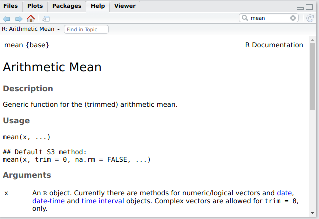

  
```{r, include=FALSE}
library(learnr)
```
  


## Einleitung
Dieses Skript ist als Teil der Bachelorveranstaltung Statistik der Wirtschaftswissenschaftlichen Fakultät an der Universität Göttingen entstanden und soll Studenten helfen auf eine einfache und direkte Art und Weise die wichtigsten Funktion der Statischen Programmiersprache **R** zu verstehen und anwenden zu können. Der Inhalt soll des Weiteren allen Studierenden helfen welches Interesse oder Fragen hinsichtlich **R**-Programmierung haben.

Die aktuellste Version des Skriptes, sowie die unterliegenden Source-Files, sind im Gitlab-Repository ["intro2r"](https://gitlab.gwdg.de/kruse44/intro2r) zu finden.

Dieses Skript wurde in [Rmarkdown](https://rmarkdown.rstudio.com/) und dem [learnr](https://rstudio.github.io/learnr/)-Package geschrieben und erstellt. Es handelt sich hierbei um einen Work-in-Progress und wird ständig durch Mitarbeiter des Lehrstuhl Statistik der Universität Göttingen erweitert und verbessert. Daher würden die Autoren sich sehr über Verbesserungsvorschläge, neue Ideen oder Fehlermeldungen freuen. Hierfür einfach eine E-Mail an folgende Adresse:

  &emsp;&emsp;&emsp; gitlab+kruse44-intro2r-10509-issue-@gwdg.de 

Das folgende Lehrmaterial ist und wird immer frei sein und kann unter einer [CC-BY-SA 4.0 Lizenz](https://creativecommons.org/licenses/by-sa/4.0/deed.de) verwendet, verbreitet und modifiziert werden.  Der Hauptautor der originalen Version ist [René-Marcel Kruse](https://www.uni-goettingen.de/en/610058.html)  (<a href="https://github.com/RMKruse/">Github@RMKruse</a>, <a href="https://gitlab.gwdg.de/kruse44">gitlab.gwdg@kruse44</a>) unter Mitwirkung von:

* Jasmin Schilling

Dieses Skript bezieht sich auf verschiedene Quellen, deren inhaltliche Aufarbeitung und Darstellung der Thematik, als Grundlage und Bezugspunkt beim Erstellen dieses Skriptes dienten. Hierbei sei vor allem auf folgende Quellen verwiesen, wobei es sich bei allen Quellen um Free-and-Open-Source Lehrinhalte der jeweiligen Autoren handelt:

* [Advanced R](http://adv-r.had.co.nz/) von [Hadley Wickham](http://hadley.nz/)
* [Merely Useful: Novice R](https://merely-useful.github.io/r/index.html) von [Madeleine Bonsma-Fisher et al.]()
* [R for Data Science](#https://r4ds.had.co.nz/) von [Hadley Wickham](http://hadley.nz/) und [Garrett Grolemund](https://twitter.com/statgarrett?lang=de)
* [Hands-On Programming with R](#https://rstudio-education.github.io/hopr/) von [Garrett Grolemund](https://twitter.com/statgarrett?lang=de)
* [Fundamentals of Data Visualization](#https://serialmentor.com/dataviz/) von [Claus O. Wilke](https://github.com/clauswilke)
* [YaRrr! The Pirate’s Guide to R](#https://bookdown.org/ndphillips/YaRrr/) von [Nathaniel D. Phillips](https://ndphillips.github.io/index.html)

Des Weiteren diente als Grundlage die Vorlesungsfolien des Statistik-Master Kurses "Introduction to Statistical Programming" von [Paul Wiemann](https://www.uni-goettingen.de/de/525900.html).


## Interaktion mit **R** und Rstudio

Du hast jetzt also **R** und RStudio auf deinem Rechner installiert und willst sofort loslegen, aber vorher ist es erst einmal wichtig zu verstehen was der Unterschied zwischen **R** und RStudio ist und wieso du beide brauchst.
Wenn du deinem Rechner den Befehl geben willst etwas für dich zu berechnen, dann musst du wissen wie du überhaupt mit ihm sprechen kannst. Hierbei stellt RStudio den Weg dar, um mit dem Computer zu interagieren, während **R** selbst die Sprache ist in der du dich mit deinem Rechner "unterhälst".
Um nun mit und in **R** zu arbeiten rufst du also einfach RStudio auf. WICHTIG! Nicht **R** selbst aufrufen (auch wenn dieses funktioniert und einige alte hartgesottene Programmierer darauf schwören).


### Das User Interface von Rstudio
<!--TODO: Verlinkung auf Anhang für veränderungen von Rstudio-->
  Wenn du Rstudio zum ersten Mal öffnest wirst du von folgenem Bild begrüßt.

<!--  -->

  

Was du hier siehst ist Rstudio in seiner Standard Konfiguration. Im folgenden Abschnitt wirst du die drei bzw. vier Fenster oder auch Panes genannten Interaktionsfelder von RStudio näher kennen lernen und verstehen wie du diese benutzen kannst. Hierbei gehen wir von links nach rechts vor.


### Die Console-Oberfläche
<!-- TODO: R definition für code chunks ändern, die ``` werden angezeigt. -->
  Das Consolen Fenster findest du in der Grundausführung von Rstudio auf der linken Seite und es dient dir als direktes Interaktionsfenster mit **R** und dadurch mit dem Computer. Jeder Code der in der Console eingegeben und durch Enter bestätigt wird, wird durchgeführt (engl. to run code).

<!--  -->
  

  Du kannst in die **R**-Console einfache Rechenaufgaben eingeben und **R** wird dir wie eine Art Taschenrechner die Lösung der Aufgabe ausgeben.

```{r}
2 + 3
```

Die **R**-Console ist allerdings viel mehr als eine Art Taschenrechner, du  kannst hier dem Computer direkt über **R**-Code komplexe Befehle geben.

Es ist Zeit für euren ersten selbst geschriebenen Code. Hierfür befehlst du dem Rechner die Worte "Hallo Welt!" widerzugeben. Dabei nutzt du den Befehl `print()`, gibst in die Klammer die Worte ein und führst den Code über das Drücken der Enter-Taste aus. Hierbei ist es wichtig die Worte in Anführungszeichen einzugeben `" "` um den Rechner zu symbolisieren, dass es sich um menschliche Sprache handelt.

```{r, include=FALSE}
library(learnr)
```

```{r hallowelt, exercise=TRUE}

```

```{r hallowelt-solution}
print("Hallo Welt!")
```


Herzlichen Glückwunsch! Du hast hiermit deinen ersten R-Code geschrieben.

Allerdings ist es oft schwer und sehr langwierig gewisse Befehle jedes Mal neu einzugeben, sodass **R** bereits eine Vielzahl an implementierten Befehlen wie den oben genutzten  `print()` kennt.
So kannst du ohne viel Programmierkenntnisse dem PC sagen Zahlen zu runden:

```{r}
round(2.5)
```

Oder die Uhrzeit eures Systems ausgeben lassen:

```{r}
Sys.time()
```

Wie du mit den verschieden Funktionen richtig umgehst, neue hinzufügst und eigene selbst schreibst wirst du im späteren Verlauf lernen können.

### Die Script-Oberfläche

  <!-- TODO: Einleitung: Oft einfacher Über Skript zu gehen anstatt alles immer einzutippen -->

Das Eingeben von Code in die Console kann auf Dauer mühsam sein, vor allem wenn du denselben Code wiederholst, komplexere Eingaben tätigst oder aufeinander folgende Operationen ausführen willst. Daher kommen wir noch von der Console zur Script- oder Source-Oberfläche.

Diese Oberfläche ist beim ersten Starten von Rstudio nicht zu sehen, kann allerdings über den Reiter File --> New File --> R Script geöffnet werden. Alternativ kannst du einfach ein neues Skript über die Tastenkombination: Strg + Shift + N öffnen. Hierbei sei die Nutzung des Keyboard-Shortcuts zu bevorzugen, da diese Art und Weise schneller und direkter von statten geht.

Du wirst nun ein leeres Dokument sehen in welchem du den R-Code schreiben kannst ohne ihn gleich auszuführen. Diese Oberfläche bzw. das Skript dient also als eine Art Sammelstelle für deinen Code. Das Skript kann ebenfalls gespeichert werden, sodass du in der Lage bist Code später (wieder) auszuführen oder ihn gar zu teilen oder später bei einer Seminar- oder Abschlussarbeit abzugeben.

  <!--  -->


Gebe jetzt in dieses neue Fenster den Code aus dem letzten Abschnitt ein. Du wirst merken, dass dieser nicht sofort ausgeführt wird. Um den Code zu nutzen musst du diesen an die Console "schicken". Hierfür gibt es verschiedene Methoden. Hierfür kannst du zum einen den auszuführenden Code mit der Maus/Keyboard markieren und dann auf den Button "Run" klicken. Der viel einfachere und von uns vorgeschlagene Weg ist, einfach den Code durch das drücken von Strg + Enter (Linux, Windows) bzw. Command + Enter (Mac) auszuführen.

  Ein von dir geschriebenes Skript kannst du einfach über den Reiter File --> Save As abspeichern, sodass du das File jeder Zeit an dem Ort findest mit dem Namen "Euer_Skript_Name.R".

### Die Environment-Oberfläche

<!-- TODO: Verweis auf das Kapitel für Objekte etc einfügen -->
Das in der Ausgangskonfiguration sich rechts oben befindliche Environment-Feld dient verschiedener Aufgaben. In aller erster Linie sind dort alle Objekte zu finden welche gerade in R definiert sind. 

<!--  -->


Als kleines Beispiel der folgende Code:


```{r, eval = TRUE}
1:10
x <- 1:10
```

<!-- <!--  -->

<!--  -->


Hierbei erstellst du eine Sequenz an Zahlen von 1 bis 10. Im ersten Beispiel wird diese Sequenz ausgegeben, während beim zweiten Beispiel du der Variable `x` die Werte der Sequenz von 1 bis 10 zuweist. Im folgenden Kapitel werden wir im genaueren die Thematik des Variablen zuweisen behandeln, jetzt reicht es zu verstehen, dass durch diese Zuweisung eine Variable gespeichert wird welche den jeweiligen Wert speichert. Darüberhinaus  erscheint nun rechts im Environment Feld der Eintrag für `x.` Dies bedeutet, dass nun wann immer du in der R Console oder im Skript die Größe `x` benutzt die zugewiesene Sequenz von 1 bis 10 ausgegeben oder benutzt wird.

<!--  -->


Wenn du auf den zweiten Tab „History“ klickst wird dir eine chronologische sortierte Auflistung aller von dir ausgeführtem **R** Befehle angezeigt. Dieser Tab hilft dir also als eine Art Anlaufstelle für Fehlersuche oder zu verstehen was du beim letzten Mal in er überhaupt gemacht hast.

<!--  -->


Zu guter Letzt bietet die Environment-Oberfläche das manuelle Einlesen von Daten über den Butto "Import Dataset".Indem du diesen Button bedienst öffnet sich ein Dropdown Menü indem du die verschiedenen Arten von importierbaren Daten auswählen kannst. Dieses Menü erlaubt dir so das einlesen und bearbeiten von Daten aus

  - Text-Datein (.txt, .csv, ...)
  - Excel (.xls, .xlsc, .xml, ...)
  - SPSS
  - STATA
  - SAS


### Die Output-Oberfläche
Die Tafel Files / Plots / Packages / Help zeigt dir viele hilfreiche Informationen. Wir gehen jede Registerkarte im Detail durch.


<!--  -->


  Dateien - Das Datei-Panel gibt dir Zugriff auf das Dateiverzeichnis auf deiner Festplatte. Eine nette Eigenschaft des "Dateien"-Panels ist, dass du es benutzen kannst, um dein Arbeitsverzeichnis festzulegen - sobald du zu einem Ordner navigierst, in dem du Dateien lesen und speichern möchtest, klicke auf "Mehr" und dann auf "Als Arbeitsverzeichnis festlegen". Über Arbeitsverzeichnisse werden wir bald ausführlicher sprechen.
 
 Plots - Das Plots-Panel (keine große Überraschung), zeigt alle deine Plots. Es gibt Schaltflächen zum Öffnen des Plots in einem separaten Fenster und zum Exportieren des Plots.
 
Pakete - Zeigt eine Liste aller auf deiner Festplatte installierten **R**-Pakete an und zeigt an, ob sie derzeit geladen sind oder nicht. Pakete, die in der aktuellen Sitzung geladen sind, werden geprüft, während die installierten, aber noch nicht geladenen Pakete nicht markiert sind. 

  Hilfe - Hilfemenü für **R**-Funktionen. Du kannst entweder den Namen einer Funktion in das Suchfenster eingeben oder den Code verwenden, um nach einer Funktion mit dem Namen


Übersetzt mit www.DeepL.com/Translator (kostenlose Version)


<!--  -->


Hierfür gibt es 2 verschiedene Möglichkeiten. Die erste, du nutzt ein einziges `?` gefolgt von dem Namen der Funktion zu der du mehr wissen möchtest, oder du nutzt `?? ` gefolgt von einem Ausdruck zu dem du mehr wissen möchtest. Wie du hieran erkennen kannst ist der Unterschied einfach darin zu sehen, dass man nur ein Fragezeichen nutzt, wenn man bereits die Funktion kennt, um die es geht und zwei Fragezeichen, wenn man eine Funktion finden möchte, um ein Problem zu lösen. 

```{r, eval = FALSE}
?sd
# Oder auch möglich als
help(mean)
```

Falls du nicht direkt die Lösung deines Problems findest, die Erklärung/Beispiel nicht verständlich genug ist oder dein Problem zu komplex für die interne Rstudio-Hilfe ist gibt es verschiedene Arten um an Hilfe zu kommen.

Eine der größten, wichtigsten und oft hilfreichsten Plattformen ist <a href="https://stackoverflow.com/" title="s">StackOverflow</a>

## Teste dein **R** Wissen
```{r, include=FALSE}
library(learnr)
```
*Aufgabe 1:*

```{r aufgabe1_1, echo=FALSE}
question("Welche(r) der folgenden Panes gibt es nicht in Rstudio",
         answer("History"),
         answer("Console"),
         answer("Browser", correct = TRUE),
         answer("Input", correct = TRUE),
         answer("Script"),
         random_answer_order = TRUE
)
```

*Aufgabe 2:*

```{r aufgabe1_2, echo=FALSE}
question("Welche der folgenden Methoden erlaubt es dir Information zu **R** Funktionen zu erhalten?",
         answer("?-Operator", correct = TRUE),
         answer("??-Operator", correct = TRUE),
         answer("help()", correct = TRUE),
         answer("googlen ;-)", correct = TRUE),
         answer("StackOverflow", correct = TRUE),
         random_answer_order = TRUE
)
```


*Aufgabe 3:*

```{r aufgabe1_3, echo=FALSE}
question("In welchem Pane findest du die Variablen welche in R zugewiesen worden sind?",
         answer("Environment", correct = TRUE),
         answer("Console"),
         answer("Outputs"),
         answer("Script"),
         random_answer_order = TRUE
)
```
